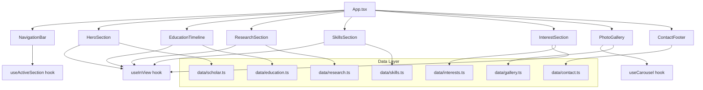

# Design Document: Research Scholar Portfolio

## Overview

A single-page React application serving as a static portfolio for a research scholar. The site is built with React (Create React App or Vite), uses CSS Modules for scoped styling, and ships as static files with no backend. Content is driven by static data files (TypeScript constants). The page renders seven sections in a fixed order — Hero, Education Timeline, Research, Skills, Areas of Interest, Photo Gallery, and Contact Footer — with a sticky navigation bar, viewport-triggered animations, and a responsive layout across mobile, tablet, and desktop breakpoints.

### Key Design Decisions

| Decision | Choice | Rationale |
|---|---|---|
| Build tool | Vite + React + TypeScript | Fast dev server, optimized static build, type safety |
| Styling | CSS Modules | Scoped styles, no runtime cost, works with minimalist theme |
| Animation | Custom `useInView` hook + CSS transitions | Lightweight, no library dependency, respects `prefers-reduced-motion` |
| Carousel | Custom component | Avoids heavy carousel libraries; requirements are well-scoped |
| Data | TypeScript constant files | Static content, type-checked, no API layer needed |
| Image loading | Native `loading="lazy"` | Browser-native lazy loading, zero JS overhead |

## Architecture



### Project Structure

```
src/
├── App.tsx
├── App.module.css
├── main.tsx
├── index.css                  # Global resets, CSS custom properties (theme)
├── components/
│   ├── NavigationBar/
│   │   ├── NavigationBar.tsx
│   │   └── NavigationBar.module.css
│   ├── HeroSection/
│   │   ├── HeroSection.tsx
│   │   └── HeroSection.module.css
│   ├── EducationTimeline/
│   │   ├── EducationTimeline.tsx
│   │   └── EducationTimeline.module.css
│   ├── ResearchSection/
│   │   ├── ResearchSection.tsx
│   │   └── ResearchSection.module.css
│   ├── SkillsSection/
│   │   ├── SkillsSection.tsx
│   │   └── SkillsSection.module.css
│   ├── InterestSection/
│   │   ├── InterestSection.tsx
│   │   └── InterestSection.module.css
│   ├── PhotoGallery/
│   │   ├── PhotoGallery.tsx
│   │   └── PhotoGallery.module.css
│   └── ContactFooter/
│       ├── ContactFooter.tsx
│       └── ContactFooter.module.css
├── hooks/
│   ├── useInView.ts
│   ├── useActiveSection.ts
│   └── useCarousel.ts
├── data/
│   ├── scholar.ts
│   ├── education.ts
│   ├── research.ts
│   ├── skills.ts
│   ├── interests.ts
│   ├── gallery.ts
│   └── contact.ts
└── types/
    └── index.ts
```

## Components and Interfaces

### App (App.tsx)

Root component that renders all sections in the required order (Req 13.1). Wraps content in a semantic `<main>` element with the NavigationBar outside it.

```tsx
const App: React.FC = () => (
  <>
    <NavigationBar sections={SECTION_ORDER} />
    <main>
      <HeroSection />
      <EducationTimeline />
      <ResearchSection />
      <SkillsSection />
      <InterestSection />
      <PhotoGallery />
      <ContactFooter />
    </main>
  </>
);
```

### NavigationBar

| Prop | Type | Description |
|---|---|---|
| `sections` | `SectionLink[]` | Ordered list of section IDs and labels |

Behavior:
- Renders as a `<nav>` with `position: sticky; top: 0`.
- Each link calls `document.getElementById(sectionId).scrollIntoView({ behavior: 'smooth' })` (Req 2.2).
- Uses `useActiveSection` hook to highlight the currently visible section link (Req 2.4).
- On viewports below 768px, collapses into a hamburger menu with a slide-out drawer (Req 11.2).

```tsx
interface SectionLink {
  id: string;
  label: string;
}

interface NavigationBarProps {
  sections: SectionLink[];
}
```

### HeroSection

No props — reads from `data/scholar.ts`.

Renders: full name, academic title, affiliation, tagline, and profile photo (Req 1.1, 1.3). Uses `useInView` to trigger a fade-in animation on load (Req 1.4).

```tsx
const HeroSection: React.FC = () => {
  const { ref, isInView } = useInView({ triggerOnce: true });
  // renders scholar info with fade-in class when isInView is true
};
```

### EducationTimeline

No props — reads from `data/education.ts`.

Renders milestones in reverse chronological order (Req 3.2). Each entry shows institution, degree, field, and year range (Req 3.1). Uses a vertical timeline layout: two-column on desktop, single-column on mobile (Req 11.4). Each entry uses `useInView` for entrance animation (Req 3.3).

### ResearchSection

No props — reads from `data/research.ts`.

Renders research items as cards with title, description, venue, and an external link (`target="_blank"` with `rel="noopener noreferrer"`) (Req 4.1, 4.2, 4.3). Each card uses `useInView` for entrance animation (Req 4.4).

### SkillsSection

No props — reads from `data/skills.ts`.

Groups skills by category (Req 5.1). Each category has a visual indicator (icon or colored tag) (Req 5.2). Uses `useInView` with staggered delay per item via CSS `transition-delay` (Req 5.3).

### InterestSection

No props — reads from `data/interests.ts`.

Renders each interest as a distinct card with label and summary (Req 6.1, 6.2). Uses `useInView` for entrance animation (Req 6.3).

### PhotoGallery

No props — reads from `data/gallery.ts`.

Uses the `useCarousel` hook for all carousel logic. Renders navigation arrows (Req 7.2), supports touch swipe (Req 7.3), auto-advances (Req 7.4), pauses on interaction (Req 7.5), and loops (Req 7.6). Images not in view use `loading="lazy"` (Req 12.2). Adjusts visible photo count by viewport (Req 11.3).

### ContactFooter

No props — reads from `data/contact.ts`.

Renders email, social/academic links (each with `target="_blank"`) (Req 8.1, 8.2), and a copyright notice with `new Date().getFullYear()` (Req 8.3).

---

### Hooks

#### useInView

Intersection Observer-based hook that detects when an element enters the viewport.

```tsx
interface UseInViewOptions {
  threshold?: number;    // default 0.1
  triggerOnce?: boolean; // default true — animate only on first appearance (Req 10.1)
}

interface UseInViewReturn {
  ref: React.RefObject<HTMLElement>;
  isInView: boolean;
}

function useInView(options?: UseInViewOptions): UseInViewReturn;
```

The hook checks `window.matchMedia('(prefers-reduced-motion: reduce)')`. If the user prefers reduced motion, `isInView` is always `true` (elements render in final state immediately) (Req 10.4).

#### useActiveSection

Tracks which section is currently in the viewport center and returns its ID.

```tsx
function useActiveSection(sectionIds: string[]): string | null;
```

Uses Intersection Observer on all section elements. Returns the ID of the section with the highest intersection ratio.

#### useCarousel

Encapsulates all carousel state and behavior.

```tsx
interface UseCarouselOptions {
  totalItems: number;
  autoAdvanceMs?: number;  // default 4000
  visibleCount?: number;   // default 1, adjusted by viewport
}

interface UseCarouselReturn {
  currentIndex: number;
  next: () => void;
  prev: () => void;
  goTo: (index: number) => void;
  pause: () => void;
  resume: () => void;
  handlers: {
    onTouchStart: (e: React.TouchEvent) => void;
    onTouchEnd: (e: React.TouchEvent) => void;
  };
}

function useCarousel(options: UseCarouselOptions): UseCarouselReturn;
```

Behavior:
- `next()` / `prev()` wrap around using modular arithmetic (Req 7.6).
- Auto-advance runs via `setInterval`; calling `pause()` clears it, `resume()` restarts it (Req 7.4, 7.5).
- Touch handlers track `touchStart` and `touchEnd` X coordinates; a swipe threshold of 50px triggers `next()` or `prev()` (Req 7.3).
- Any manual interaction (`next`, `prev`, `goTo`, swipe) calls `pause()` automatically (Req 7.5).

## Data Models

All data is defined as typed constants in `src/data/`.

```typescript
// types/index.ts

export interface Scholar {
  fullName: string;
  title: string;          // e.g. "Ph.D. Candidate"
  affiliation: string;    // e.g. "MIT Computer Science"
  tagline: string;
  profilePhotoUrl: string;
}

export interface EducationMilestone {
  id: string;
  institution: string;
  degree: string;
  field: string;
  startYear: number;
  endYear: number | null;  // null = present
}

export interface ResearchItem {
  id: string;
  title: string;
  description: string;
  venue: string;           // journal, conference, or project context
  externalUrl: string;
}

export interface SkillCategory {
  category: string;
  skills: string[];
}

export interface InterestArea {
  id: string;
  label: string;
  summary: string;
}

export interface GalleryPhoto {
  id: string;
  src: string;
  alt: string;
}

export interface ContactInfo {
  email: string;
  links: SocialLink[];
}

export interface SocialLink {
  platform: string;       // "Google Scholar" | "ORCID" | "LinkedIn" | "GitHub" | etc.
  url: string;
  icon?: string;          // optional icon identifier
}

export interface SectionLink {
  id: string;
  label: string;
}
```

### Color Theme Specification (Req 9)

Defined as CSS custom properties in `index.css`:

```css
:root {
  /* Five-color palette */
  --color-primary: #1a1a2e;      /* Deep navy — headings, nav background */
  --color-secondary: #16213e;    /* Dark blue — section alternating bg */
  --color-accent: #0f3460;       /* Medium blue — links, highlights */
  --color-surface: #f5f5f5;      /* Light gray — main background */
  --color-text: #1a1a2e;         /* Dark — body text on light bg */

  /* Contrast pairs (all ≥ 4.5:1 per Req 9.4):
     --color-text on --color-surface  → ~14.5:1
     white on --color-primary         → ~12.8:1
     white on --color-accent          → ~7.2:1
  */

  /* Typography — two font families (Req 9.3) */
  --font-heading: 'Playfair Display', serif;
  --font-body: 'Inter', sans-serif;

  /* Animation tokens */
  --animation-duration: 500ms;   /* under 600ms per Req 10.2 */
  --animation-easing: cubic-bezier(0.25, 0.46, 0.45, 0.94); /* Req 10.3 */

  /* Spacing */
  --section-padding: 5rem 1.5rem; /* ample whitespace per Req 9.2 */
}

@media (prefers-reduced-motion: reduce) {
  :root {
    --animation-duration: 0ms;
  }
}
```

### Animation CSS Pattern

Each animated component applies a common pattern:

```css
.animated {
  opacity: 0;
  transform: translateY(20px);
  transition: opacity var(--animation-duration) var(--animation-easing),
              transform var(--animation-duration) var(--animation-easing);
}

.animated.visible {
  opacity: 1;
  transform: translateY(0);
}
```

The `visible` class is toggled by the `useInView` hook's `isInView` value.

### Responsive Breakpoints (Req 11.1)

```css
/* Mobile-first approach */
/* Base styles: mobile (< 768px) */

@media (min-width: 768px) {
  /* Tablet styles */
}

@media (min-width: 1025px) {
  /* Desktop styles */
}
```

## Correctness Properties

*A property is a characteristic or behavior that should hold true across all valid executions of a system — essentially, a formal statement about what the system should do. Properties serve as the bridge between human-readable specifications and machine-verifiable correctness guarantees.*

### Property 1: Hero section renders all scholar fields

*For any* valid `Scholar` object, the rendered `HeroSection` output should contain the `fullName`, `title`, `affiliation`, and `tagline` strings, and an `` element with `src` equal to `profilePhotoUrl`.

**Validates: Requirements 1.1, 1.3**

### Property 2: NavigationBar renders all section links in order

*For any* list of `SectionLink` items, the `NavigationBar` should render exactly one link per item, and the links should appear in the DOM in the same order as the input list.

**Validates: Requirements 2.1, 13.2**

### Property 3: Active section detection returns highest-intersection section

*For any* set of section IDs and corresponding intersection ratios, `useActiveSection` should return the section ID with the highest intersection ratio.

**Validates: Requirements 2.4**

### Property 4: Education milestones rendered in reverse chronological order

*For any* list of `EducationMilestone` objects, the `EducationTimeline` should render them sorted by `endYear` (or `startYear` if `endYear` is null) in descending order.

**Validates: Requirements 3.2**

### Property 5: Education milestone renders all required fields

*For any* valid `EducationMilestone` object, the rendered timeline entry should contain the `institution`, `degree`, `field`, `startYear`, and `endYear` values.

**Validates: Requirements 3.1**

### Property 6: Research item renders all fields with valid external link

*For any* valid `ResearchItem` object, the rendered card should contain the `title`, `description`, and `venue` strings, and an anchor element with `href` equal to `externalUrl` and `target="_blank"`.

**Validates: Requirements 4.1, 4.2**

### Property 7: Skills are grouped by category

*For any* list of `SkillCategory` objects, the `SkillsSection` should render each category as a distinct group, and every skill string within a category should appear under its category heading.

**Validates: Requirements 5.1**

### Property 8: Staggered animation delay is proportional to item index

*For any* list of N skill items within a category, the i-th item (0-indexed) should have a `transition-delay` value proportional to `i * delayStep`, where `delayStep` is a positive constant.

**Validates: Requirements 5.3**

### Property 9: Interest area renders label and summary

*For any* valid `InterestArea` object, the rendered card should contain both the `label` and `summary` strings.

**Validates: Requirements 6.1**

### Property 10: Carousel visible count matches viewport breakpoint

*For any* viewport width, the carousel's `visibleCount` should be: 1 for mobile (< 768px), 2 for tablet (768–1024px), and 3 for desktop (> 1024px).

**Validates: Requirements 7.1, 11.3**

### Property 11: Swipe gesture triggers carousel navigation

*For any* touch interaction where the horizontal swipe distance exceeds the threshold (50px), a left swipe should advance to the next photo and a right swipe should go to the previous photo. Swipes below the threshold should not change the index.

**Validates: Requirements 7.3**

### Property 12: Manual carousel interaction pauses auto-advance

*For any* carousel state where auto-advance is running, calling `next()`, `prev()`, or `goTo()` should cause auto-advance to be paused.

**Validates: Requirements 7.5**

### Property 13: Carousel loops via modular arithmetic

*For any* carousel with `totalItems = N` (N > 0), calling `next()` when `currentIndex` is `N - 1` should set `currentIndex` to `0`, and calling `prev()` when `currentIndex` is `0` should set `currentIndex` to `N - 1`.

**Validates: Requirements 7.6**

### Property 14: Contact footer renders all contact information

*For any* valid `ContactInfo` object, the rendered `ContactFooter` should contain the `email` string and an anchor element for each entry in `links` with the correct `url` and `target="_blank"`.

**Validates: Requirements 8.1, 8.2**

### Property 15: Color theme contrast ratio meets accessibility minimum

*For any* text/background color pair defined in the CSS custom properties, the computed contrast ratio should be greater than or equal to 4.5:1.

**Validates: Requirements 9.4**

### Property 16: useInView triggerOnce prevents re-triggering

*For any* element observed by `useInView` with `triggerOnce: true`, once `isInView` becomes `true`, it should remain `true` regardless of subsequent intersection changes (element leaving and re-entering the viewport).

**Validates: Requirements 10.1**

### Property 17: Reduced motion preference disables animations

*For any* element observed by `useInView`, when `prefers-reduced-motion: reduce` is active, `isInView` should always return `true` immediately (bypassing the intersection check), so elements render in their final state without animation.

**Validates: Requirements 10.4**

### Property 18: Non-visible gallery images are lazy-loaded

*For any* `GalleryPhoto` in the gallery that is not the currently visible slide, the corresponding `` element should have the `loading="lazy"` attribute.

**Validates: Requirements 12.2**

## Error Handling

Since this is a static site with no backend, error handling is minimal but still important:

| Scenario | Handling |
|---|---|
| Missing profile photo | Render a placeholder avatar with the scholar's initials and appropriate `alt` text |
| Empty data arrays (e.g., no research items) | Hide the corresponding section entirely rather than showing an empty container |
| Broken external links | Links use `target="_blank"` and `rel="noopener noreferrer"`; the portfolio itself is unaffected if the external resource is down |
| Missing gallery photos | Skip broken images in the carousel; if all images fail, hide the Photo Gallery section |
| JavaScript disabled | CSS Modules ensure basic layout renders; animations degrade gracefully (elements show in final state via `<noscript>` fallback styles) |
| Intersection Observer unsupported | `useInView` hook checks for `IntersectionObserver` support; if unavailable, returns `isInView: true` so all content is visible |
| Touch events unsupported | Carousel touch handlers are no-ops on non-touch devices; arrow controls remain functional |

## Testing Strategy

### Unit Tests

Use Vitest + React Testing Library for component and hook unit tests. Focus on:

- Specific rendering examples (e.g., a known Scholar object renders correctly)
- Section ordering (Req 13.1) — verify DOM order matches expected sequence
- Hamburger menu appears at mobile viewport (Req 11.2)
- Copyright year displays current year (Req 8.3)
- Auto-advance fires after interval (Req 7.4) using `vi.useFakeTimers()`
- Animation duration CSS value is under 600ms (Req 10.2)
- Easing function is not "linear" (Req 10.3)
- External links have `rel="noopener noreferrer"` attribute
- Edge cases: empty data arrays, null endYear in education milestones

### Property-Based Tests

Use **fast-check** as the property-based testing library with Vitest.

Configuration:
- Minimum 100 iterations per property test (`fc.assert(property, { numRuns: 100 })`)
- Each test tagged with a comment referencing the design property

Each of the 18 correctness properties above maps to exactly one property-based test:

| Test | Property | Tag |
|---|---|---|
| Hero fields | Property 1 | `Feature: research-scholar-portfolio, Property 1: Hero section renders all scholar fields` |
| Nav link order | Property 2 | `Feature: research-scholar-portfolio, Property 2: NavigationBar renders all section links in order` |
| Active section | Property 3 | `Feature: research-scholar-portfolio, Property 3: Active section detection returns highest-intersection section` |
| Education sort | Property 4 | `Feature: research-scholar-portfolio, Property 4: Education milestones rendered in reverse chronological order` |
| Education fields | Property 5 | `Feature: research-scholar-portfolio, Property 5: Education milestone renders all required fields` |
| Research fields + link | Property 6 | `Feature: research-scholar-portfolio, Property 6: Research item renders all fields with valid external link` |
| Skills grouping | Property 7 | `Feature: research-scholar-portfolio, Property 7: Skills are grouped by category` |
| Stagger delay | Property 8 | `Feature: research-scholar-portfolio, Property 8: Staggered animation delay is proportional to item index` |
| Interest fields | Property 9 | `Feature: research-scholar-portfolio, Property 9: Interest area renders label and summary` |
| Carousel visible count | Property 10 | `Feature: research-scholar-portfolio, Property 10: Carousel visible count matches viewport breakpoint` |
| Swipe navigation | Property 11 | `Feature: research-scholar-portfolio, Property 11: Swipe gesture triggers carousel navigation` |
| Pause on interaction | Property 12 | `Feature: research-scholar-portfolio, Property 12: Manual carousel interaction pauses auto-advance` |
| Carousel loop | Property 13 | `Feature: research-scholar-portfolio, Property 13: Carousel loops via modular arithmetic` |
| Contact fields | Property 14 | `Feature: research-scholar-portfolio, Property 14: Contact footer renders all contact information` |
| Contrast ratio | Property 15 | `Feature: research-scholar-portfolio, Property 15: Color theme contrast ratio meets accessibility minimum` |
| Trigger once | Property 16 | `Feature: research-scholar-portfolio, Property 16: useInView triggerOnce prevents re-triggering` |
| Reduced motion | Property 17 | `Feature: research-scholar-portfolio, Property 17: Reduced motion preference disables animations` |
| Lazy loading | Property 18 | `Feature: research-scholar-portfolio, Property 18: Non-visible gallery images are lazy-loaded` |

### Test Organization

```
src/
└── __tests__/
    ├── components/
    │   ├── HeroSection.test.tsx
    │   ├── NavigationBar.test.tsx
    │   ├── EducationTimeline.test.tsx
    │   ├── ResearchSection.test.tsx
    │   ├── SkillsSection.test.tsx
    │   ├── InterestSection.test.tsx
    │   ├── PhotoGallery.test.tsx
    │   └── ContactFooter.test.tsx
    ├── hooks/
    │   ├── useInView.test.ts
    │   ├── useActiveSection.test.ts
    │   └── useCarousel.test.ts
    └── properties/
        ├── hero.property.test.tsx
        ├── navigation.property.test.tsx
        ├── education.property.test.tsx
        ├── research.property.test.tsx
        ├── skills.property.test.tsx
        ├── interests.property.test.tsx
        ├── carousel.property.test.tsx
        ├── contact.property.test.tsx
        ├── theme.property.test.ts
        ├── animation.property.test.ts
        └── gallery.property.test.tsx
```
